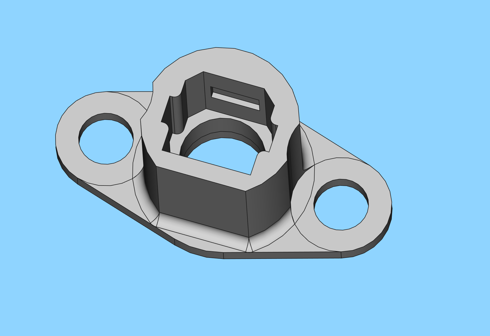

# TOSLink Launcher

Author: <josh@joshisanerd.com>

License: CC0 / Public Domain

This is a quick-and-dirty PCB mounted TOSLink launcher, which can
couple an SMD LED into a TOSLINK optical cable.  The project includes
both the FreeCAD model and a KiCad demo project (which you can pull
the library/module/STP file out of and into your own setup to use
these.)

There is also an included STL file, but see below on the settings it
was printed with.

## Background
 
TOSLink is a really handy fiber optic cable: you can buy them easily,
reasonably cheaply, and in various lengths.  They are meant for audio,
but they're just flexible lightpipes at the end of the day.

You can buy TOSLink connectors that solder onto PCBs, but they only
come with red LEDs (which is used in the audio application).  If you
want to put arbitrary colors through them, it gets complicated.  So, I
decided to make a little connector that would let me mount a TOSLink
cable over an arbitrary surface mount LED.

## Limitations of included STL file

The STL included here assumes that your printer needs 0.2mm of
fudge-factor on each side to get good results on interior holes.  This
has been the case on both of my FDM printers, but it's probably going
to be suboptimal on SLA (or a particularly well-tuned FDM printer).

It is designed to put the end of the fiber cable 0.7mm above the
surface it's bolted down to.

## Mounting this on a PCB

The mounting arrangement for this is two holes 17mm apart.  I
recommend using 5mm drill hits for these, as you will need to align
the fiber optics perfectly with the LED underneath it.  To do this,
you want to move the connector around a little after it's mounted to
the PCB.  Putting M3 screws through a 5mm hole lets you move up to 1mm
in any direction from center, which should be good enough.

The recommended PCB footprint is an 8mm circle around those M5s, and a
13mm circle about your LED.  (I never claimed this was a
space-efficient footprint…)

## The KiCad demo project

There is a KiCad demo project in toslink_launcher_test.  Opening this
up in KiCad, then going to pcbnew, you should be able to do a 3D view
and see the parts rendered there.

The KiCad demo project includes a separate README.txt which describes
how to import all this into your own KiCad.

## The FreeCAD model

The model was developed in Ubuntu 20.04's distribution of FreeCAD, so
it's an ancient v0.18.4 file.  Apologies if it doesn't actually open
properly in newer versions.

This is a spreadsheet-driven FreeCAD file: if you need to adjust the
squeeze-out fudge factor, or the height of the LED, etc, you can open
the Spreadsheet in the file, tweak the values in that spreadsheet
(don't forget to include “mm” or FreeCAD will have a pedantic little
fit), and it should update the model.  You can then Activate the
“TOSLink Launcher001” Body object by double-clicking on it, and then
File > Export, and type in “toslink_launcher_foo.stl” (you also need
to add the STL there, FreeCAD's great).

This is also a reasonable starting point for the TOSLink connector;
there are precious few models using it, so hopefully this is a good
jumping-off point for anyone else who wants to use these cables for
alternate purposes.

## Further support

Please find someone to assist you with this: unfortunately, I don't
really have the time to help people with it.  This project is being
released more as a starting point for others than as a product in and
of itself.

## Contents:

* README.md: this file
* toslink_launcher.FCStd: FreeCAD v0.18.4 model
* toslink_launcher_v3.stl: STL of the actual launcher
* toslink_launcher_test/: KiCad demo project for the launcher
* imgs/: Images.
